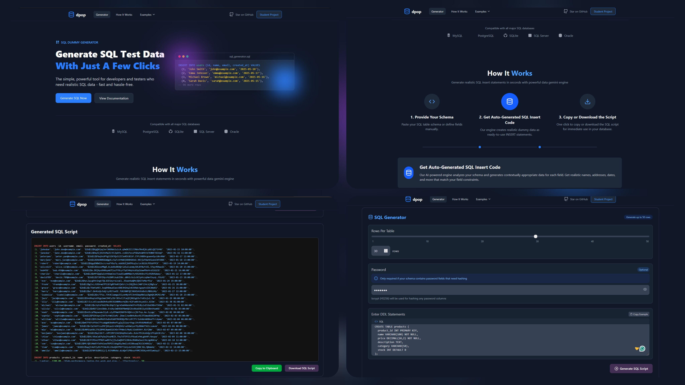

# dpop - AI-Powered dummy data generator
Generate realistic dummy data for your SQL database in seconds. Just provide your SQL schema — and get ready-to-use `INSERT` statements and `SQL Script` tailored to your table definitions.

## Preview 



## 🚀 Features

- 📝 **Schema Input**: Paste your `CREATE TABLE` statements.
- 🤖 **AI-Powered Generation**: Automatically detects column types and generates realistic values.
- 🔐 **Secure Password Hashing**: Password fields are hashed using bcrypt for enhanced security.
- 💾 **Ready-to-Use SQL**: Instantly copy or download `INSERT` scripts.
- 🎯 **Field-Aware Values**: Generates contextually appropriate data matching your field constraints.
- 🎛️ **Configurable**: Set the number of rows per table (up to 50).
- ⚡ **Fast and Free**: Built with performance in mind using Vite + React.

## 🖥️ Tech Stack

* **Frontend**: React, Vite, Tailwind CSS, shadcn
* **Backend**: FastAPI (Python), google-genai
* **AI/ML**: 
Google Gemini API (via AI Studio) - `gemini-2.0-flash-lite`
* **File Storage**: 
   * Scrapped PDF from multiple sources
   * PicSum
* **Infrastructure**: Google Cloud Compute (Self-hosted)

## File Structure
```
📦 Root
├─ 🔧 Configuration & Entrypoints
│  ├─ .gitignore
│  └─ readme.md

├─ 🧠 Backend (app)
│  ├─ main.py
│  ├─ requirements.txt
│  ├─ 📁 data/ # Handles dummy PDF generation and scraping
│  ├─ 📁 utils/ # Functions for DDL splitting and data generation

├─ 🌐 Frontend (client)
│  ├─ ⚙️ Config & Meta (package.json, eslint, prettier, etc.)

│  ├─ 🖼️ public/ # images and logo

│  ├─ 📁 src
│  │  ├─ App bootstrap and root styling
│  │  ├─ 📁 components
|  |
│  │  │  ├─ 📁 landing
│  │  │  │  ├─ Hero and How It Works sections
│  │  │  └─ 📁 ui
│  │  │  |  └─ Shadcn Button component
│  │  ├─ 📁 lib
│  │  │  └─ Shared frontend utilities
```


## Setup Instructions

### Prerequisites

*   Git
*   Python 3.8+, Pip and python-venv or conda or mamba for virtual environment
*   Node.js (v18+) and npm
*   Google Cloud Account with:
    *   Service Account key file (`.json`) with GCS permissions.
    *   Google AI Studio API Key (for Gemini).

### Installation & Configuration

1.  **Clone the repository:**
    ```bash
    git clone https://github.com/shubhamkumaar/dpop.git
    cd GDG_assisT
    ```

2.  **Backend Setup:**
    ```bash
    cd server
    # Create and activate a virtual environment (recommended)
    python -m venv venv
    source venv/bin/activate  # On Windows use `venv\Scripts\activate`

    # Or use conda/mamba
    conda create -n "dpop"
    conda activate assist

    # Install dependencies
    pip install -r requirements.txt

    # Create .env file from example
    cp .env.example .env

    # Edit .env file and add your credentials:
    # GEMINI_API_KEY="YOUR_GEMINI_API_KEY"
3.  **Frontend Setup:**
    ```bash
    cd ../client

    # Install dependencies
    npm install

    # Create .env file from example
    cp .env.example .env

    # Edit .env file and add your credentials:
    # VITE_API_URL="http://localhost:8000" # Your backend API base URL
    ```

### Running the Application

1.  **Run the Backend Server:**
    ```bash
    # cd to root folder of the repo
    cd ..
    # Make sure your virtual environment is activated
    uvicorn app.main:app --reload --host 0.0.0.0 --port 8000
    ```
    The backend API will be available at `http://localhost:8000`.

2.  **Run the Frontend Development Server:**
    ```bash
    cd client
    npm run dev
    ```
    The frontend application will be available at `http://localhost:5173` (or another port if 5173 is busy).

3.  **Access the Application:** Open your web browser and navigate to `http://localhost:5173`.

### Running the generated SQL Script

```bash 
psql -h localhost -d userstoreis -U admin -p 5432 -a -q -f /path/to/script/file/postgresql.sql
```

- -h PostgreSQL server IP address
- -d database name
- -U user name (postgres)
- -p port which PostgreSQL server is listening on
- -f path to SQL script
- -a all echo
- -q quiet 
- -f file
## API Documentation

The backend API uses FastAPI, which automatically generates interactive API documentation. Once the backend server is running, you can access it at:

*   **Swagger UI:** `http://localhost:8000/docs`
*   **ReDoc:** `http://localhost:8000/redoc`
*   **OpenAPI Schema:** `http://localhost:8000/openapi.json`

## Contributing

If you wish to contribute further, please feel free to fork the repository and submit pull requests.

1.  Fork the Project
2.  Create your Feature Branch (`git checkout -b feature/AmazingFeature`)
3.  Commit your Changes (`git commit -m 'Add some AmazingFeature'`)
4.  Push to the Branch (`git push origin feature/AmazingFeature`)
5.  Open a Pull Request

## Author
Built with ❤️ by Shubham Kumar

💼 Developer | 💻 MERN Stack Developer
t